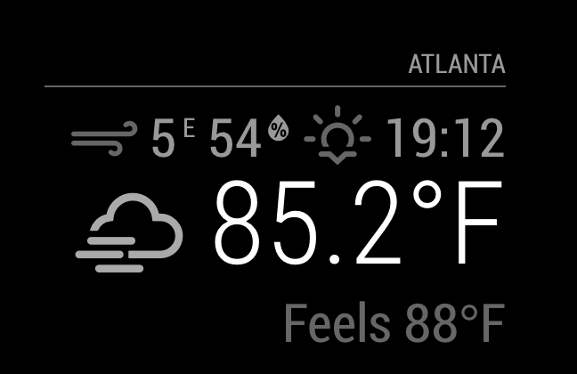

# MMM-Currentweather-MQTT

The MMM-Currentweather-MQTT is based an the standard module `currentweather` and the module `MMM-MQTT`.

The `currentweather` module is one of the default modules of the MagicMirror.
This module displays the current weather, including the windspeed, the sunset or sunrise time, the temperature and an icon to display the current conditions.

If the values originate from MQTT telegrams, the values are displayed in white. If the values are from Openweather, they are displayed in yellow.

For configuration options, please check the [MagicMirror² documentation](https://docs.magicmirror.builders/modules/currentweather.html).
## Screenshot



## Installation

Go to `MagicMirror/modules` and write

```
    git clone https://github.com/spitzlbergerj/MMM-Currentweather-MQTT
    cd MMM-Currentweather-MQTT
    npm install
```


## Configuration

Attention - first version with rigid processing of my MQTT telegrams

Here is an example configuration with description. Put it in the `MagicMirror/config/config.js` file:

```javascript
{
	module: "MMM-Currentweather-MQTT",
	position: "top_right",
	config: {
		location: "XYZ",
		locationID: "1234567",
		appid: "<yourAppID>",
		roundTemp: true,
		degreeLabel: true,
		showWindDirection: true,
		showWindDirectionAsArrow: true,
		showHumidity: true,
		showFeelsLike: false,
		useBeaufort: false,
		useKMPHwind: true,
		logging: true,
		useWildcards: false,
		mqttServers: [
			{
				address: 'xxx.xxx.xxx.xxx',  // Server address or IP address
				port: '1883',                // Port number if other than default
				subscriptions: [             // for now, all seven values must be 
				                             // specified in the config, 
							     // even if they are not delivered and not displayed.
					{
						topic: 'wetter/act-temp', // Topic to look for
						suffix: '°C',             // Displayed after the value
						decimals: 0,              // Round numbers to this number of decimals
						sortOrder: 10,            // sortOrder 10 has to contain the temperature 
						maxAgeSeconds: 18000,     // take Openweather value if older than 5 hours
					},
					{
						topic: 'wetter/act-hum',
						suffix: '%',
						decimals: 0,
						sortOrder: 20,            // sortOrder 210 has to contain the humidity
						maxAgeSeconds: 18000,
					},
					{
						topic: 'wetter/act-illum',
						sortOrder: 30,            // sortOrder 30 has to contain the illumination
						maxAgeSeconds: 18000,
					},
					{
						topic: 'wetter/act-wind-speed',
						suffix: 'km/h',
						decimals: 0,
						sortOrder: 40,            // sortOrder 40 has to contain the wind speed
						maxAgeSeconds: 18000,
					},
					{
						topic: 'wetter/act-wind-dir',
						suffix: '°',
						decimals: 0,
						sortOrder: 50,            // sortOrder 50 has to contain the wind direction
						maxAgeSeconds: 18000,
					},
					{
						topic: 'wetter/raining',
						suffix: '',
						decimals: 0,
						sortOrder: 60,            // sortOrder 60 has to contain the boolean if its just raining
						maxAgeSeconds: 18000,
						conversions: [
							{ from: "true", to: "ja" },
							{ from: "false", to: "nein" }
						]
					},
					{
						topic: 'wetter/rain-today',
						suffix: '',
						decimals: 1,
						sortOrder: 70,            // sortOrder 70 has to contain the amount of rain today
						maxAgeSeconds: 18000,
					},
				]
			}
        ],
	}
},
```

## Configuration options

<table width="100%">
    <thead>
        <tr>
            <th>Option</th>
            <th width="100%">Description</th>
        </tr>
        <thead>
        <tbody>
            <tr>
                <td><code>mqttServerAddress</code></td>
                <td>IP address of the MQTT Broker
                </td>
            </tr>
            <tr>
                <td><code>mqttServerUser</code></td>
                <td>Port of MQTT Broker
                </td>
            </tr>
            <tr>
                <td><code>mqttServerUser</code></td>
                <td>User to access the MQTT Broker (optional)
                </td>
            </tr>
            <tr>
                <td><code>mqttServerPassword</code></td>
                <td>Password of user to access the MQTT Broker (optional)
                </td>
            </tr>
            <tr>
                <td><code>mqttTopics</code></td>
                <td>Topics for the MQTT Broker (optional)
            </tr>
        </tbody>
</table>
